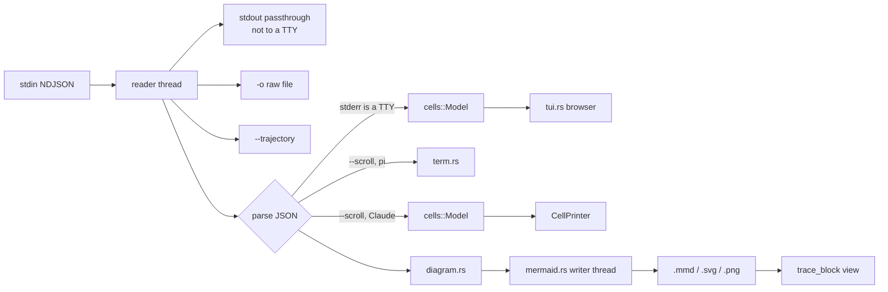

# Developing trace_block

## The rule

`trace_block` is a *transparent* tracer. Before adding anything to a view, check that it maps 1:1 to
a field that is recorded in the event stream.

- No reconstructed values (e.g. "this request probably carried N messages").
- No self-measured metrics presented as backend data (TTFT, tokens/s). Tool durations are the one
  exception, measured start→end by trace_block and shown as such.
- No interpretive labels ("the model emits reasoning even though…"). Explanations belong in docs or
  in a conversation, not in the view.
- When something is absent, say so (`stop (not in stream)`), don't guess.
- Context that is not from the stream must name its source (pi provider `baseUrl` → "from
  ~/.pi/agent/models.json").
- Every cell's detail view (`l`) shows the recorded JSON, unmodified except for pretty-printing
  (key order preserved via serde_json's `preserve_order`).

## Layout

```
src/
  main.rs        CLI parsing, stdin reader thread, passthrough / -o / --trajectory, mode dispatch
  term.rs        scroll view for pi streams (append-only, in-place streaming of deltas on a TTY)
  cells.rs       event → cell model shared by the browser and the Claude scroll view
                 (pi events + Claude Code stream-json events, turns, final answer, tool stats)
  tui.rs         interactive browser (raw /dev/tty, alternate screen, keys, search, detail view,
                 status rows, help) and CellPrinter (scroll view for Claude Code streams)
  md.rs          streaming-friendly Markdown → ANSI (answers)
  jsonhl.rs      JSON syntax highlighting for the detail view
  trajectory.rs  --trajectory: JSONL (byte-exact line filter) or Markdown
  diagram.rs     pi events → Mermaid sequence diagram source
  mermaid.rs     mmdr rendering, rasterising, atomic file writer thread, inline image protocols,
                 terminal capability probe (kitty query + DA1 + cell size)
  view.rs        `trace_block view`: full-screen live diagram viewer
  textdia.rs     character-cell rendering of our Mermaid subset (for terminals without graphics)
  replay.rs      `trace_block replay`: re-stream a recorded trace with realistic pacing
  util.rs        wrapping, truncation, badges, small helpers
tests/
  cli.rs         end-to-end tests of the binary
  data/          small synthetic streams and session logs (pi and Claude Code) — no third-party content
scripts/
  tui_drive.py   drive a TUI in a pty + pyte and print screen snapshots
  herdr_cast.py  record a herdr pane to an asciicast (demo recordings)
  record_demo.sh the README demo: drive a real run, record, render GIF/MP4
  herdr_shot.py  screenshot a herdr pane to PNG (site illustrations)
site/            the project site (GitHub Pages)
docs/            demo.gif / demo.cast
fixtures/        (gitignored) your own recorded traces; tests that need them are skipped if absent
```

## Data flow



The raw bytes of each line are forwarded before parsing, so malformed lines are passed through
unchanged (and reported in the view).

## Input formats

### pi (`pi --mode json`)

Line 1 is `{"type":"session",…}`. Events of interest:

| event | used for |
|---|---|
| `turn_start` / `turn_end` | TURN headers, per-turn stop reason and usage |
| `message_start` (role `system`) | tool definitions (`toolsAdded`), prompt sections |
| `message_start` (role `assistant`) | provider / model / api |
| `message_update.assistantMessageEvent` | `thinking_*`, `text_*`, `toolcall_*` deltas |
| `message_end` | complete messages: user prompt, assistant (usage, stopReason, rawStopReason, responseId, responseModel, providerThinkingLevel, diagnostics, errorMessage), toolResult |
| `tool_execution_start/update/end` | tool blocks (`end` has no `args`: match by `toolCallId`) |
| `auto_retry_start/end` | retries |
| `agent_settled` | completion marker (a killed run has none) |

The final answer is the answer text of the turn whose `stopReason` is `stop`.

### Claude Code (`claude -p --output-format stream-json --verbose [--include-partial-messages]`)

| event | used for |
|---|---|
| `system/init` | session, model, tool names, MCP servers |
| `stream_event` (`message_start`, `content_block_*`, `message_delta`, `message_stop`) | live deltas; `message_delta` carries the stop reason and usage |
| `assistant` | one complete content block per event, grouped by `message.id` (authoritative over deltas) |
| `user` | `tool_result` blocks (`is_error`) |
| `system/*` | `permission_denied`, hooks, `thinking_tokens` (`estimated_tokens`), … |
| `rate_limit_event` | shown as an event cell |
| `result` | duration, turns, cost, usage (`output_tokens_details.thinking_tokens`), result text |

Things to know: each assistant `message.id` is one API request (shown as one TURN); `assistant`
events have `stop_reason: null`; `user` tool results can arrive before the stream's `message_delta`,
so a streamed message is finalised at `message_stop`; the prompt is not in the stream; thinking
blocks have empty text when the request carried the `redact-thinking` beta (interactive CLI in 2.1.285,
not `claude -p`). Without partial messages the stop reason is shown as absent, and the
final answer is the answer cell whose text equals `result.result`.

Detection: `cells::is_claude_event` — the Claude event types (`system`, `assistant`, `user`,
`stream_event`, `result`, `rate_limit_event`) never occur in pi streams.

### Session logs

- **pi** (`~/.pi/agent/sessions/…/<ts>_<id>.jsonl`): the same `session` header line, then entries with
  `id`/`parentId`: `model_change`, `thinking_level_change`, and `message` entries holding complete
  `AgentMessage`s (`system`, `user`, `assistant`, `toolResult`). Handled by
  `Model::pi_session_message` (each assistant message = one turn; the final answer from its
  `stopReason`). In the scroll view the first `session` line is held until the next line shows whether
  this is a live stream or a session log.
- **Claude Code** (`~/.claude/projects/<cwd>/<session>.jsonl`): `user` / `assistant` entries shaped like
  stream-json (one content block per assistant entry) plus transcript-only entries (`attachment`,
  `queue-operation`, `last-prompt`, `ai-title`, `mode`, …). Every entry has a camelCase `sessionId`,
  which is how they are recognised; assistant entries carry the real `stop_reason`.
- Both set `Model::session_log`: no wall-clock timings are shown (turn clock, tool durations) and the
  end of input is `end of session log` rather than "unfinished".

### Adding another producer

1. Record a real stream and look at every event type before writing code (see *Recording fixtures*).
2. Add a detector and a `Model::<producer>_event` handler in `cells.rs` that maps events onto the
   existing cell kinds; keep raw JSON in `Cell::body` for anything that doesn't map.
3. Extend `trajectory.rs` (which lines are "messages") and `replay.rs` pacing.
4. Add a small synthetic stream to `tests/data/` and CLI assertions in `tests/cli.rs`.

## Building and testing

```bash
cargo build --release
cargo test                    # unit tests + tests/cli.rs
cargo fmt --check             # rustfmt.toml: max_width = 120
cargo clippy --all-targets -- -D warnings
```

MSRV is 1.90 (edition 2024; `ordered-float` and `quantette` need 1.90). CI runs all of the above on Linux and macOS.

### Test data

- `tests/data/*.jsonl` are hand-written synthetic streams that follow the real schemas. They are the
  basis of `tests/cli.rs` (byte-exact passthrough including malformed lines, scroll output, unfinished
  streams, `-o`, `--trajectory`, Claude detection, `replay`, Mermaid output).
- `fixtures/` is for your own recorded traces. It is gitignored because real traces contain tool
  output (third-party text), local paths and account metadata. Unit tests that use them go through
  `fixture_or_skip!("name.jsonl")` and are skipped when the file is missing.

### Recording fixtures

```bash
pi --mode json -p "…" > fixtures/my-pi-run.jsonl
claude -p "…" --output-format stream-json --verbose --include-partial-messages \
  --setting-sources "" --tools "Read Grep Glob" < /dev/null > fixtures/my-claude-run.jsonl
```

Count what's in a fixture (events per type, tools, errors) with a quick script and take test
expectations from those counts — not from memory.

### Testing the interactive browser

- **Replay** a trace with realistic timing: `trace_block replay FILE --speed 3 | trace_block`.
- **Terminal emulator**: `scripts/tui_drive.py` runs a command in a pty with a
  [pyte](https://github.com/selectel/pyte) screen, sends keys and prints snapshots; pyte's buffer also
  exposes colors (`screen.buffer[y][x].fg/.bg/.reverse`) for asserting highlighting.
- **Real multiplexer**: in [herdr](https://herdr.dev) (or tmux) create a pane, `pane run` the command,
  `send-text` keys, `pane read --source visible [--format ansi]` and assert on the screen.
- Terminal capability probing can be tested by answering the queries from a fake pty (kitty graphics
  `\e_Gi=31;OK\e\\`, DA1 `\e[?62;4c` for sixel, `\e[6;H;Wt` for the cell size).

### Recording the README demo

`scripts/record_demo.sh <pane-id>` drives a real run in a [herdr](https://herdr.dev) pane and records
it: `scripts/herdr_cast.py` polls `herdr pane read --format ansi` and writes an asciicast v2 file
(one complete frame per screen change), [agg](https://github.com/asciinema/agg) renders
`docs/demo.gif`, ffmpeg makes an MP4 (attached to the release). Check a few frames before
committing (`ffmpeg -i docs/demo.gif -vf "select=eq(n\,30)" -frames:v 1 f.png`) and make sure the
recording shows nothing private (paths, account data, third-party text).

### The project site

`site/` is a static page (plain HTML + CSS, no build step) published to GitHub Pages by
`.github/workflows/pages.yml` on pushes that touch `site/`. Its screenshots in `site/img/` are real
captures: drive a scene in a herdr pane and run `scripts/herdr_shot.py <pane> site/img/<name>.png`
(one-frame asciicast → agg → PNG). Use shareable content only (e.g. the public-domain corpus in the
demo, the synthetic streams in `tests/data/`). Preview locally with
`python3 -m http.server -d site 8000`.

## CI and releases

- `.github/workflows/ci.yml` — on pushes and pull requests: fmt, clippy (`-D warnings`), tests on
  `ubuntu-latest` and `macos-latest`, plus an MSRV build.
- `.github/workflows/release.yml` — on a `v*` tag: builds release binaries for
  `x86_64/aarch64-unknown-linux-gnu` and `x86_64/aarch64-apple-darwin` (Intel macOS cross-compiled on Apple Silicon), packages
  `trace_block-<tag>-<target>.tar.gz` (binary + README + LICENSE), writes `SHA256SUMS`, and publishes a
  GitHub Release with the matching `CHANGELOG.md` section as notes.

To cut a release:

```bash
# 1. bump `version` in Cargo.toml, add a section to CHANGELOG.md
cargo build --release && cargo test
git commit -am "Release vX.Y.Z"
# 2. tag and push — the release workflow does the rest
git tag vX.Y.Z && git push origin main vX.Y.Z
```

The workflow checks that the tag matches the `Cargo.toml` version.
